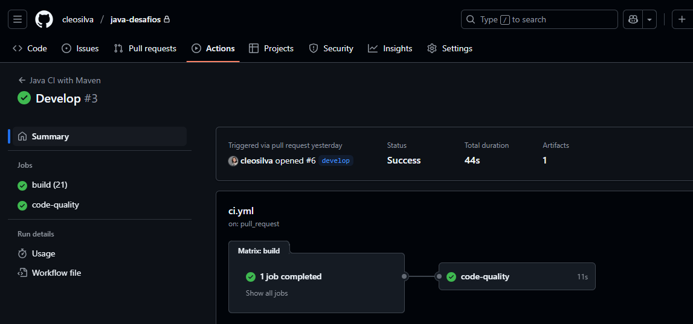

# 💻 Desafios Java — Do Básico ao Avançado

Este repositório reúne uma coleção de desafios em **Java**, organizados por **níveis de dificuldade** e **conceitos fundamentais da linguagem e da orientação a objetos**. Os desafios foram elaborados como parte da minha jornada de aprendizado e prática rumo à excelência em desenvolvimento back-end com Java.

---

## 🧭 Níveis e Foco de Aprendizagem

| Nível | Título                           | Foco                                                                 |
|-------|----------------------------------|----------------------------------------------------------------------|
| 1     | Fundamentos                      | Construtores, `final`, `record`, `static`, herança básica           |
| 2     | Abstração e Estrutura            | Coleções, polimorfismo, interfaces, generics                        |
| 3     | Robustez e Interação             | Exceções, leitura/escrita de arquivos (I/O Streams)                 |
| 4     | Integração e Arquitetura         | Camadas, serviços, padrões, integração de conceitos                 |

---

## ✅ Desafios Resolvidos

### 🟢 Nível 1: Fundamentos

| Código | Desafio                                                   | Caminho                   |
|--------|-----------------------------------------------------------|---------------------------|
| 1.1    | Gerenciamento Simples de Produtos                         | [`nivel-1/desafio-1.1`](https://github.com/cleosilva/java-desafios/tree/main/src/main/java/org/cleosilva/nivel1/desafio1) |
| 1.2    | Contador de Instâncias com `static`                       | [`nivel-1/desafio-1.2`](https://github.com/cleosilva/java-desafios/tree/main/src/main/java/org/cleosilva/nivel1/desafio2) |
| 1.3    | Hierarquia de Animais (Herança)                           | [`nivel-1/desafio-1.3`](https://github.com/cleosilva/java-desafios/tree/main/src/main/java/org/cleosilva/nivel1/desafio3) |

---

### 🟡 Nível 2: Abstração e Estrutura

| Código | Desafio                                                   | Caminho                                                                                                                 |
|--------|-----------------------------------------------------------|-------------------------------------------------------------------------------------------------------------------------|
| 2.1    | Sistema de Biblioteca (Herança + Coleções)                | [`nivel-2/desafio-2.1`](https://github.com/cleosilva/java-desafios/tree/main/src/main/java/org/cleosilva/nivel2/desafio1) |
| 2.2    | Sistema de Pagamento com Interface                        | [`nivel-2/desafio-2.2`](https://github.com/cleosilva/java-desafios/tree/main/src/main/java/org/cleosilva/nivel2/desafio2) |
| 2.3    | Caixa Genérica (Generics)                                 | [`nivel-2/desafio-2.3`](https://github.com/cleosilva/java-desafios/tree/main/src/main/java/org/cleosilva/nivel2/desafio3)                                                                                         |

---

### 🟠 Nível 3: Robustez e Interação

| Código | Desafio                                                   | Caminho                                |
|--------|-----------------------------------------------------------|----------------------------------------|
| 3.1    | Validação de Entrada com Exceções                         | [`nivel-3/desafio-3.1`](nivel-3/desafio-3.1) |
| 3.2    | Logger com Escrita em Arquivo                             | [`nivel-3/desafio-3.2`](nivel-3/desafio-3.2) |

---

### 🔴 Nível 4: Integração e Arquitetura

| Código | Desafio                                                   | Caminho                                |
|--------|-----------------------------------------------------------|----------------------------------------|
| 4.1    | Sistema de Pedidos Completo                               | [`nivel-4/desafio-4.1`](nivel-4/desafio-4.1) |
| 4.2    | Serviços com Logger e Configurações                       | [`nivel-4/desafio-4.2`](nivel-4/desafio-4.2) |

---

## 🔧 Tecnologias e Ferramentas

### **Linguagem e Build**
- **Java 21** (LTS) - Utilizando recursos modernos como Records
- **Maven** - Gerenciamento de dependências e build
- **JUnit 5 + AssertJ** - Testes unitários (preparado para implementação)

### **CI/CD Pipeline**
- **GitHub Actions** - Integração e entrega contínua
- **Execução automática** em push e pull requests
- **Artefatos de build** salvos automaticamente

---

## 🚀 CI/CD Implementation

### **Pipeline Status**


### **O que o CI faz automaticamente:**

#### **🔍 Build Pipeline**
- ✅ **Checkout do código** - Baixa o código do repositório
- ✅ **Setup Java 21** - Configura o ambiente JDK
- ✅ **Cache Maven** - Otimiza tempo de build reutilizando dependências
- ✅ **Validação** - Verifica integridade do projeto Maven
- ✅ **Compilação** - Compila todos os arquivos `.java`
- ✅ **Empacotamento** - Gera JARs executáveis
- ✅ **Execução automática** - Testa execução dos desafios
- ✅ **Upload de artefatos** - Salva builds para download (5 dias)

#### **🧪 Quality Pipeline**
- ✅ **Análise de estrutura** - Verifica organização do código
- ✅ **Verificação de padrões** - Analisa qualidade do código
- ✅ **Relatórios** - Gera métricas de linhas e arquivos

### **Triggers do CI:**
```yaml
# Executa automaticamente em:
- Push para branches: main, develop
- Pull requests para: main
```

### **Visualização dos Resultados:**
- **GitHub Actions Tab** - Logs detalhados de execução
- **Commits** - Status visual (✅/❌) em cada commit
- **Pull Requests** - Validação automática antes do merge
- **Artifacts** - Download dos JARs compilados

---

## 📦 Estrutura do Projeto

```bash
java-desafios/
├── .github/
│   └── workflows/
│       └── ci.yml                 # 🔄 Pipeline de CI/CD
├── README.md
├── pom.xml                        # 📦 Configuração Maven
├── src/
│   └── main/
│       └── java/
│           └── org/
│               └── cleosilva/
│                   ├── nivel1/
│                   │   ├── desafio1/
│                   │   ├── desafio2/
│                   │   └── desafio3/
│                   ├── nivel2/
│                   │   ├── desafio1/
│                   │   ├── desafio2/
│                   │   └── desafio3/
│                   ├── nivel3/
│                   └── nivel4/
└── target/                        # 🎯 Arquivos compilados (gerado automaticamente)
```

---

## 🧪 Como Executar

### **Pré-requisitos:**
```bash
java -version    # Java 21+
mvn -version     # Maven 3.6+
```

### **Execução Local:**

#### **Via Maven:**
```bash
# Compilar o projeto
mvn clean compile

# Executar um desafio específico
mvn exec:java -Pnivel1-desafio1

# Gerar JAR
mvn package

# Executar testes (quando implementados)
mvn test
```

#### **Via Java direto:**
```bash
# Compilar e executar
mvn clean compile
java -cp target/classes org.cleosilva.nivel1.desafio1.Main
```

### **Execução via GitHub Actions:**
O CI executa automaticamente todos os desafios a cada push! 🚀

### **Download dos Artefatos:**
1. Vá para a aba **Actions** do repositório
2. Clique no último build bem-sucedido
3. Baixe os **artifacts** com os JARs compilados

---

## 📋 Critérios de Avaliação Pessoal

✅ **Código (40%)**: organização, clareza, uso correto dos recursos

🧱 **Arquitetura (30%)**: separação de responsabilidades, coesão e desacoplamento

📘 **Boas Práticas (20%)**: nomenclatura, exceções, legibilidade

✨ **Criatividade (10%)**: soluções elegantes e melhorias extras

---

## 🚀 Dicas de Progressão

- Comece onde estiver confortável e vá subindo o nível gradualmente
- Faça revisões do seu próprio código após 1 ou 2 dias
- Refatore sempre que puder, é assim que se aprende
- Teste edge cases (valores nulos, limites, erros esperados)
- Documente suas decisões técnicas
- **Observe o CI**: Use os logs para identificar problemas rapidamente

---

## 💡 Próximos Passos

### **Desenvolvimento:**
- 🧱 Design Patterns
- ☁️ Spring Framework e Web
- 🧵 Programação Reativa
- 🐳 Containers, APIs REST e microsserviços

### **DevOps:**
- 🔧 Testes automatizados (JUnit 5 + AssertJ)
- 🏗️ CD Pipeline (deployment automático)
- 🐋 Containerização com Docker
- 📊 Monitoramento e métricas

---

## ✍️ Sobre

Todos os desafios foram pensados para simular cenários reais, focar em boas práticas e desenvolver uma base sólida que permita crescer com segurança e autonomia.

**Novo diferencial:** Implementação de CI/CD desde o início, simulando um ambiente profissional real onde cada mudança é validada automaticamente!

Sinta-se livre para clonar, testar, dar sugestões ou feedbacks!